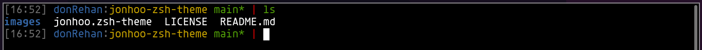
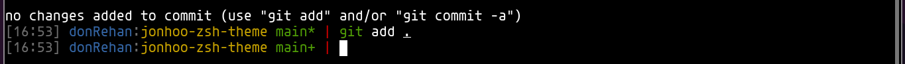

# jonhoo ZSH Theme

A clean and minimal ZSH theme for Oh-My-Zsh that displays essential information including time, hostname, current directory, and git status.

## Features

- **Timestamp**: Shows current time in HH:MM format
- **Hostname**: Displays the machine name
- **Current Directory**: Shows only the current directory name (not full path)
- **Git Integration**: 
  - Branch name
  - Unstaged changes indicator (`*`)
  - Staged changes indicator (`+`)

## Preview

### Clean Repository


### Modified Files


### Staged Files


## Installation

1. Clone this repository or download the `jonhoo.zsh-theme` file:
   ```bash
   git clone https://github.com/donRehan/jonhoo-zsh-theme.git
   ```

2. Copy the theme file to your Oh-My-Zsh custom themes directory:
   ```bash
   cp jonhoo.zsh-theme ~/.oh-my-zsh/custom/themes/
   ```

3. Edit your `~/.zshrc` file and set the theme:
   ```bash
   ZSH_THEME="jonhoo"
   ```

4. Reload your ZSH configuration:
   ```bash
   source ~/.zshrc
   ```

## Requirements

- [Oh-My-Zsh](https://ohmyz.sh/)
- A terminal with color support

## License

See [LICENSE](LICENSE) file for details.
